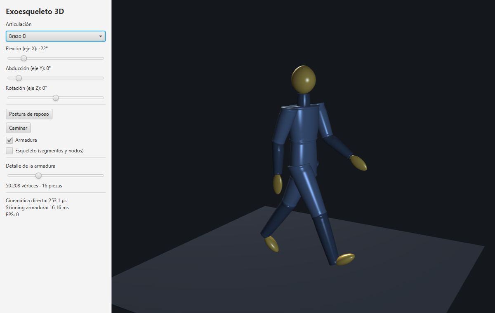
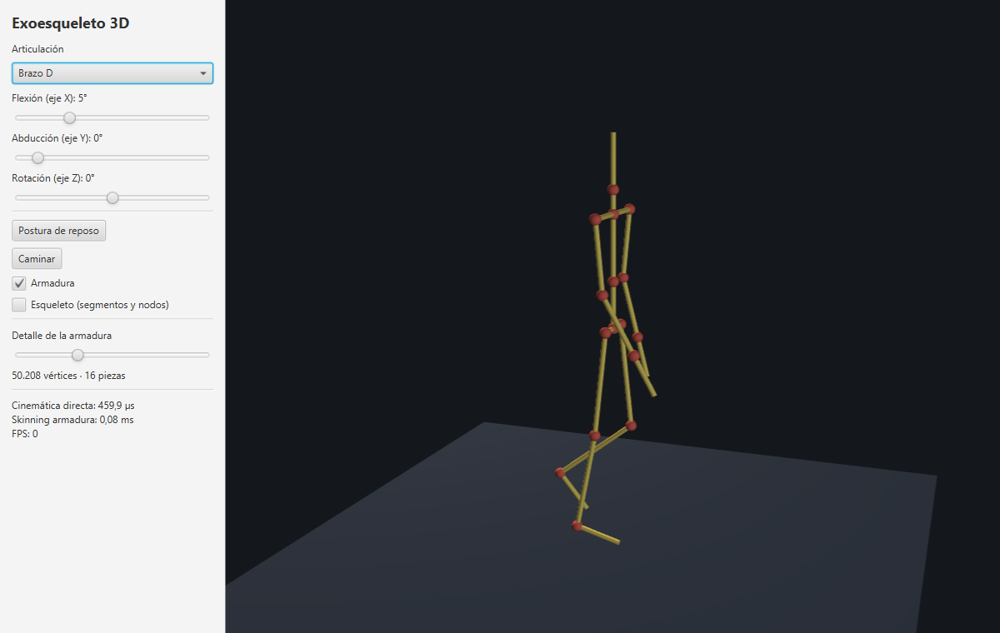

# Exoesqueleto 3D

Proyecto personal de ampliación del [lab2 de ALED](https://github.com/Ricardo4843/ALED-lab2) (Recursividad: cinemática directa de un exoesqueleto). Usa la misma cinemática directa recursiva sobre un árbol de segmentos, pero en 3D, con un cuerpo humano completo y una "armadura" de decenas de miles de vértices encima. El código está comentado a fondo para que sirva también como material de estudio.

 

## Cómo ejecutarlo

- **Eclipse:** File > Import > General > Existing Projects into Workspace, y seleccionar esta carpeta. Run sobre `exoesqueleto.gui.ExoskeletonApp`. JavaFX 23 ya viene incluido en `lib/`. Hace falta un JDK 21 o superior.
- **Terminal (PowerShell):** `.\run.ps1` abre el visor y `.\run.ps1 bench` lanza el benchmark. El script compila y lanza el programa con `JAVA_HOME` o, si no está definido, con el JDK que trae Eclipse.

Controles: arrastrar el ratón para girar la cámara y la rueda para el zoom. En el panel se elige la articulación y se mueve con los sliders (los ejes que no tiene esa articulación salen bloqueados). También hay botones para caminar y para la postura de reposo, para mostrar u ocultar la armadura y el esqueleto, y un slider para el detalle de la armadura (de unos 1.000 a unos 400.000 vértices).

## Qué cambia respecto al lab2

| lab2 (2D) | Aquí (3D) |
|---|---|
| `Segment`: longitud + 1 ángulo | `Segment`: longitud + rotación base fija + 3 ejes de articulación con límites (rodilla 1 eje, hombro 3) |
| Se acumula `(x, y, ángulo)` | Se acumula una matriz homogénea 4x4 (`Matrix4`) |
| `Node(x, y)` | `Node3D(x, y, z)` + orientación completa (frame) |
| 15 segmentos leídos de fichero | Cuerpo completo de 25 segmentos (`HumanSkeleton`) |
| Swing 2D | JavaFX 3D |

## La clave: esqueleto + malla, no 50.000 nodos

Los vértices de la armadura **no** son nodos del árbol cinemático. La cinemática directa se calcula solo para los 25 segmentos (unos microsegundos) y luego cada vértice se mueve con la matriz de su hueso: `v = Frame_actual · Frame_reposo⁻¹ · v_reposo`. Cerca de cada articulación el vértice mezcla su hueso con el del padre (*linear blend skinning*), para que la armadura se doble en vez de abrirse. Es como lo hacen los videojuegos y el software de animación (`ArmorPiece`).

## Benchmark: ¿y si el árbol sí tuviera decenas de miles de nodos?

`BenchmarkFK` (resultados en mi portátil, 2026-10-04):

| n | Árbol ancho, recursiva | Árbol ancho, iterativa | Cadena profunda, recursiva | Cadena profunda, iterativa |
|---|---|---|---|---|
| 1.000 | 1,2 ms | 1,0 ms | 0,15 ms | 0,14 ms |
| 10.000 | 3,2 ms | 2,7 ms | StackOverflowError | 1,6 ms |
| 50.000 | 25 ms | 12 ms | StackOverflowError | 7,7 ms |
| 200.000 | 122 ms | 41 ms | StackOverflowError | 245 ms |

Conclusiones:
- El coste es O(n). Con decenas de miles de nodos sigue siendo usable.
- Si el árbol es profundo, la recursión revienta la pila de Java a partir de unos pocos miles de niveles, y hace falta la versión iterativa con pila explícita (`computePositionsIterative`).
- En el lab2, el `println` de cada llamada tarda mucho más que el cálculo, así que esas medidas reflejan sobre todo lo que tarda la consola.

## Estructura

- `src/exoesqueleto/kinematics/`: `Matrix4`, `Segment`, `Node3D`, `ForwardKinematics3D` (recursiva + iterativa), `HumanSkeleton`
- `src/exoesqueleto/armor/ArmorPiece.java`: generación de la malla y skinning
- `src/exoesqueleto/gui/ExoskeletonApp.java`: visor JavaFX (también tiene un modo captura: `--snapshot=fichero.png [--walk=segundos] [--yaw=grados] [--skeleton=1]`)
- `src/exoesqueleto/bench/BenchmarkFK.java`
- `lib/`: JavaFX 23.0.2 (jars para Windows de Maven Central)

## Ideas para seguir

- Cinemática inversa: dar la posición de la mano o del pie y calcular los ángulos (CCD o jacobiano). Es el paso natural después de la directa.
- Cargar el esqueleto desde fichero, como en el lab2, o importar una armadura modelada en Blender (.obj).
- Hacer el skinning en paralelo o en GPU para los niveles de detalle altos.
- Dinámica real (masas, pares en los motores, interacción con el cuerpo): eso ya no es para JavaFX. Habría que pasar a OpenSim (tiene API Java) o a MuJoCo (Python).
